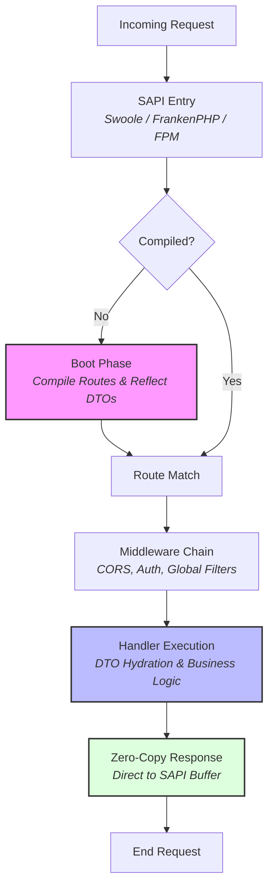

# QuillPHP Architecture Deep-Dive

QuillPHP is built on a "Boot Once, Serve Forever" philosophy. Unlike traditional PHP frameworks that re-reflect and re-init on every request, QuillPHP separates its logic into a high-overhead **Boot Phase** and a zero-overhead **Hot Path**.

---

## 1. Request Lifecycle Overview

QuillPHP handles requests in a linear, highly optimized flow. Unlike traditional frameworks that re-init for every request, Quill separates core logic into a **Boot Phase** and a **Hot Path**.

---

---

## 2. Phase Separation: The Core Optimization

### The Boot Phase (Worker Startup)
When a worker starts (Swoole or FrankenPHP), or on the first request in FPM:
1.  **Route Compilation**: The `Router` iterates over all registered routes and compiles them into a `FastRoute` dispatch table.
2.  **Reflection Caching**: For every handler (Closure or Class method), Quill reflects the parameters and stores a `paramCache` (type hint, dependency type, default values).
3.  **DTO Discovery**: The `Validator` reflects any DTO classes used in handlers, pre-parsing validation attributes (e.g., `#[Required]`, `#[Email]`) into flat constraint maps.

### The Hot Path (Request Resolution)
Once the Boot Phase is complete, the per-request cost is minimized:
- **No `ReflectionClass`** or `ReflectionMethod` calls.
- **No Service Container** lookups or recursive dependency resolution.
- **Param Injection**: Arguments are injected into handlers using the pre-calculated `paramCache`.
- **Zero-Allocation**: If no middleware is present, the framework avoids creating closures or extra pipeline objects.

---

## 3. High-Performance Components

### Router & RouteMatch
The `Router` wraps `nikic/fast-route` but adds a metadata layer. When a route is matched, a `RouteMatch` object is returned. This object is responsible for "hydrating" the handler arguments.
- It detects if a handler needs the `Request` object.
- It detects if a handler needs a `DTO` and automatically triggers `Validator::validate()`.
- It casts path variables (e.g., `{id}`) to their hinted types (`int`, `float`, etc.) instantly.

### Pipeline (Middleware)
QuillPHP uses the "Onion" middleware pattern but includes a **Fast-Path optimization**:
If `App::use()` has never been called, the `Pipeline` class skips the `array_reduce` stack building entirely and executes the destination handler directly. This saves ~0.5–1.0µs per request.

### Validator & DTOs
Validation in Quill is **Attribute-driven**. 
- Attributes are instantiated **ONCE** during `Validator::register()`.
- During the request, the `Validator` simply loops over the pre-instantiated rule objects.
- This approach is significantly faster than standard PHP validators that parse strings or re-read reflections on every request.

---

## 4. Operational Excellence

### Zero-Copy Swoole Bridge
In Swoole mode, QuillPHP bypasses standard PHP output buffering (`ob_start`).
- It maps the internal `Quill\Response` directly to `\Swoole\Http\Response`.
- Result arrays are `json_encode`d directly into the Swoole response buffer.
- This eliminates the memory and CPU overhead of capturing and re-emitting output.

### Memory & GC Management
For long-running workers, QuillPHP includes a **GC Throttling** mechanism:
- Cycles are collected every 500 requests (configurable via `QUILL_GC_INTERVAL`).
- This prevents memory leaks in complex applications while avoiding the performance hit of per-request garbage collection.

### Error Handling
Quill provides a unified exception bridge:
- `ValidationException` is caught at the `App` level and converted to a structured `422` JSON response.
- In `debug` mode, stack traces are formatted for JSON consumption, ensuring that even fatal errors provide actionable developer feedback without breaking the API client.

---

## 5. Security & Isolation

- **Immutable DTOs**: We recommend using `readonly` properties for DTOs to ensure data integrity through the handler chain.
- **CORS First-Class**: The `Cors` middleware handles preflight (`OPTIONS`) requests efficiently, often resolving them before they reach the routing layer.

---

## 6. Recommended Architecture (ADR & Hexagonal)

QuillPHP strictly enforces a clean architectural separation. Users are encouraged to completely drop MVC abstractions in favor of **Action-Domain-Responder (ADR)** and **Hexagonal Architecture**.
- **Actions (`handlers/`)**: Purely Invokable classes mapping directly to single operations. Discard multi-method Controllers. 
- **CQRS Payload (`dtos/`)**: Convert HTTP Requests into typed `Quill\DTO` classes that act as Commands/Queries, validating purely via Attributes.
- **Domain (`domain/`)**: Completely isolated business logic. Actions dispatch mapped Commands directly to Domain Application Services.
