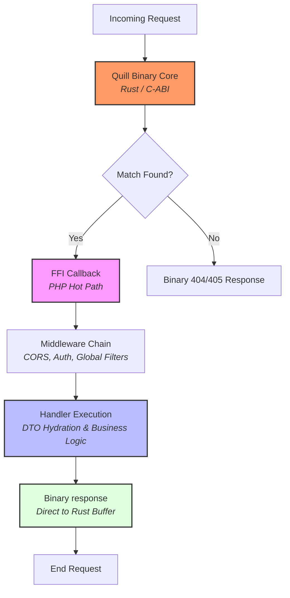

# QuillPHP Architecture Deep-Dive

QuillPHP is built on a "Boot Once, Serve Forever" philosophy. Unlike traditional PHP frameworks that re-reflect and re-init on every request, QuillPHP separates its logic into a high-overhead **Boot Phase** and a zero-overhead **Hot Path**.

---

## 1. Request Lifecycle Overview

QuillPHP handles requests via a high-performance **Binary Core** written in Rust. This core manages the HTTP server, routing, and initial validation entirely in native code before bridging to PHP via FFI.

---

## 2. Phase Separation: The Core Optimization

### The Boot Phase (Server Startup)
When the Quill Binary Server starts:
1.  **Binary Compilation**: The `Router` compiles all registered routes into a native Radix-tree structure within the Rust core.
2.  **Reflection Caching**: For every handler, Quill reflects parameters and stores a `paramCache` (type hint, dependency type, default values) in PHP memory.
3.  **Schema Registration**: The `Validator` reflects DTO classes and registers their validation schemas with the native Rust validation engine.

### The Hot Path (Request Resolution)
Once the Boot Phase is complete, the per-request cost is microsecond-level:
- **Native Routing**: Routing happens in Rust at O(log n) speed before PHP is even touched.
- **Native Validation**: JSON body validation occurs in Rust; PHP only receives pre-validated data.
- **FFI Bridge**: A single C-callback triggers the PHP handler.
- **Zero-Allocation**: No closures or pipeline objects are created for requests without middleware.

---

## 3. High-Performance Components

### Binary Router
The `Router` doesn't just match strings; it builds a native binary manifest. By offloading routing to Rust, Quill avoids the PHP overhead of regex matching or large array lookups.

### Pipeline (Middleware)
QuillPHP uses the "Onion" middleware pattern with a **Fast-Path optimization**:
If no middleware is registered, the `Pipeline` is bypassed entirely, executing the destination handler directly.

### Binary Validator & DTOs
Validation in Quill is **Native-first**. 
- Rules (e.g., `#[Required]`, `#[Email]`) are compiled into a binary schema.
- The Rust engine performs SIMD-accelerated JSON parsing and validation.
- This results in a "fail-fast" architecture where invalid requests never consume PHP worker resources.

---

## 4. Operational Excellence

### Binary Output Stream
QuillPHP bypasses `ob_start` and standard PHP output buffering.
- Handlers return data directly to the FFI memory boundary.
- The Rust core streams the response directly to the socket, eliminating multiple memory copies.

### Memory & GC Management
For the long-running Binary Server, QuillPHP includes **GC Throttling**:
- Cycles are collected periodically (configurable via `QUILL_GC_INTERVAL`).
- This maintains a stable memory footprint during high-concurrency bursts.

---

## 5. Security & Isolation

- **Immutable DTOs**: We recommend `readonly` properties for DTOs to ensure data integrity.
- **Native CORS**: CORS preflight (`OPTIONS`) is handled in the binary layer for maximum efficiency.

---

## 6. Recommended Architecture (ADR & Hexagonal)

QuillPHP encourages a clean architectural separation, dropping MVC in favor of **Action-Domain-Responder (ADR)**.
- **Actions (`handlers/`)**: Invokable classes mapping to single operations.
- **CQRS Payload (`dtos/`)**: Typed `Quill\Validation\DTO` classes acting as Commands/Queries.
- **Domain (`domain/`)**: Isolated business logic invoked by Actions.
