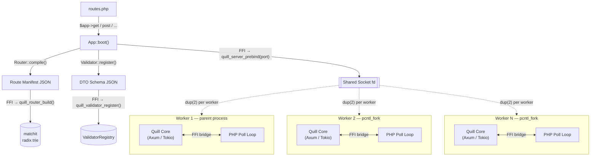
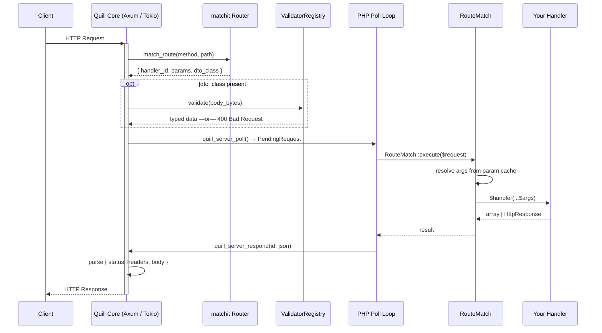

<div align="center">
  <h1>QuillPHP</h1>
  <p><strong>High-performance PHP 8.3+ API framework — boot once, serve forever.</strong></p>

[](https://github.com/quillphp/quill/actions/workflows/ci.yml)
[](https://php.net)
[](LICENSE)

### [Quick Start](.github/docs/getting-started.md) &bull; [Benchmarks](.github/docs/benchmarks.md)
</div>

---

## The Quill Philosophy

QuillPHP is a **binary-native** API framework built for extreme low-latency environments. The key insight is simple: **PHP never touches a socket.**

The native **Quill Core** (Rust + Axum + Tokio) owns the entire I/O stack — TCP connections, route matching, DTO validation, and response serialisation. PHP is woken up only to run your handler, then goes back to polling. By strictly separating a one-time **Boot Phase** from a zero-overhead **Hot Path**, Quill reaches throughput that rivals compiled languages without leaving PHP.

### Performance: Industry Benchmarks (TFB R22)

*Hardware: 48-core AMD EPYC 7R13, 512 connections. Source: [TechEmpower Round 22 JSON](https://www.techempower.com/benchmarks/#hw=ph&test=json&section=data-r22).*

| Framework | Throughput (req/s) | Avg Latency |
|:---|---:|---:|
| Actix-web 4 (Rust) | ~450,000 | ~0.22 ms |
| Axum 0.7 (Rust / Tokio) | ~330,000 | ~0.30 ms |
| Go Fiber v2 (fasthttp) | ~220,000 | ~0.45 ms |
| Go net/http (stdlib) | ~115,000 | ~0.87 ms |
| Node.js Fastify v4 | ~68,000 | ~1.47 ms |
| Node.js Express v4 | ~18,000 | ~5.56 ms |
| FastAPI + Uvicorn | ~11,000 | ~9.09 ms |

### Performance: Direct Local Measurement

*Hardware: Apple M-series (ARM64), 100 connections.*

| Framework | Throughput (req/s) | Avg Latency | Notes |
|:---|---:|---:|:---|
| **QuillPHP (Native)** | **133,627** | **1.16 ms** | `wrk` on macOS¹ |
| FrankenPHP (worker) | ~30,000 | ~3.33 ms | Estimated² |
| Laravel Octane (Swoole) | ~10,000 | ~10.0 ms | Bare route³ |

> ¹ **QuillPHP measurement** — `wrk -t4 -c100 -d10s`, `QUILL_WORKERS=4`, macOS 14.4+, PHP 8.3 (NTS), Rust core built with `--release`.
>
> ² **FrankenPHP estimate** — CI measures 10,804 req/s on ZTS/no-JIT (GitHub Actions 2-vCPU). NTS + JIT is documented at 2–3× that figure.
>
> ³ **Laravel Octane** — Bare `Route::get('/hello', fn() => [...])` with no sessions, DB, or auth middleware in a production-optimised build.

---

## Feature Highlights

- **Axum / Tokio HTTP Server** — All TCP I/O runs inside a dedicated single-threaded Tokio runtime per worker, fully bypassing PHP's process model.
- **matchit Radix Trie Router** — Routes are compiled into a native radix trie at boot; every request dispatches in O(log n) with zero PHP involvement.
- **Zero-Reflection Hot Path** — Handler parameter maps are built once at boot via reflection and cached; the hot path does a single array lookup per argument.
- **Native DTO Validation** — Schema checks run inside the Rust `ValidatorRegistry` before PHP is polled — invalid requests are rejected with a 400 without touching userland.
- **Multi-Worker via `pcntl_fork`** — The TCP port is pre-bound once, then forked N times. Each worker owns an independent Rust heap with no shared state.
- **sonic-rs SIMD JSON** — JSON compaction and encoding accelerated by `sonic-rs` across the FFI boundary.
- **OpenAPI 3.0** — Automatic Swagger UI generation directly from your route and DTO definitions.

---

## Architecture

Quill enforces a hard boundary between the **Boot Phase** (reflection, compilation, registration) and the **Hot Path** (pure dispatch). The native core owns all I/O; PHP only runs your business logic.

### Multi-Worker Model

Routes are compiled into a native manifest and the TCP port is pre-bound **before** `pcntl_fork`. Each worker independently re-initialises its Rust heap so there is zero shared state across processes.



### Request Lifecycle



> Each worker's param cache is built **once** at boot via reflection and never touched again — zero reflection on the hot path.

---

## Getting Started

### 1. Installation
```bash
composer create-project quillphp/quill my-api
cd my-api
```

### 2. Define Your Routes

```php
// routes.php
use Handlers\User\ListUsersAction;
use Handlers\User\CreateUserAction;

/** @var \Quill\App $app */

// Simple closure — zero dependencies
$app->get('/hello', fn() => ['message' => 'hello', 'status' => 'ok']);

// Class-based handler — JIT-friendly, stable param-cache key
$app->get('/users',  [ListUsersAction::class, '__invoke']);
$app->post('/users', [CreateUserAction::class, '__invoke']); // auto-validates DTO
```

### 3. Serve

```bash
# Single worker
php -d ffi.enable=on bin/quill serve

# Multi-worker (recommended for production)
QUILL_WORKERS=4 php -d ffi.enable=on bin/quill serve --port=8080
```

---

## In-Depth Guides

- [**Architecture**](.github/docs/architecture.md) — Boot phase, hot path, and the FFI bridge in detail.
- [**Routing**](.github/docs/routing.md) — Verb mapping, groups, resource routes, and path parameters.
- [**Validation**](.github/docs/validation.md) — DTOs, PHP attributes, and native schema validation.
- [**Benchmarks**](.github/docs/benchmarks.md) — Methodology, hardware specs, and full comparison results.

---

## Contributing

We welcome contributions! Please see our [Contributing Guide](.github/docs/development.md) for local setup instructions.

## License

QuillPHP is open-source software licensed under the **[MIT License](LICENSE)**.
